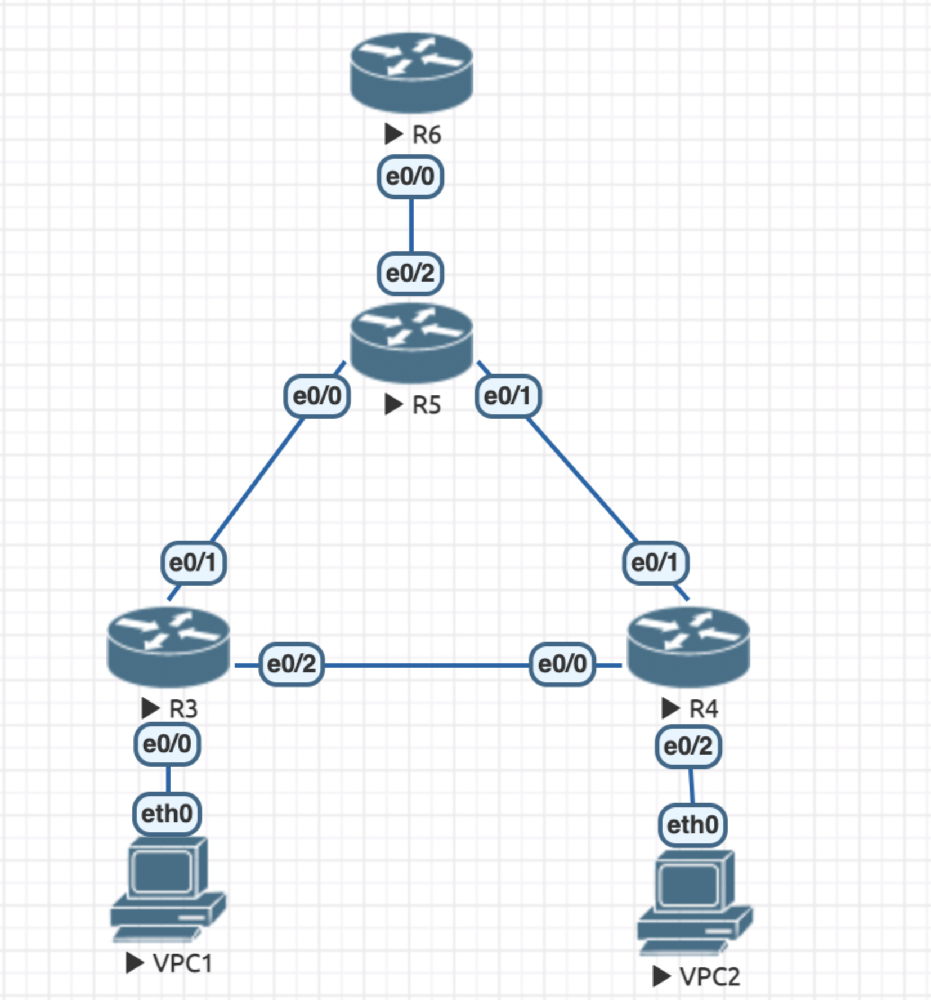

# HW 1

## Топология сети

Маршрутизатор R6, Коммутатор R5, два коммутатора доступа R3-R4, а также два клиента VPC1-VPC2.




## Конфигурация

### Клиенты в отдельных VLAN

#### VPC1
```bash
VPCS> ip 10.0.10.1/24 10.0.10.10
Checking for duplicate address...
VPCS: 10.0.10.1 255.255.255.0 gateway 10.0.10.10
```

#### VPC2
```bash
VPCS> ip 10.0.20.1/24 10.0.20.10
Checking for duplicate address...
VPCS: 10.0.20.1 255.255.255.0 gateway 10.0.20.10
```

### Настройка протокола STP

### R3
```
Switch>
Switch>en
Switch #conf t
Enter configuration commands, one per line. End with CNTL/Z.
Switch (config) #vlan 10
Switch (config-vlan) #exit
Switch (config) #vlan 20
Switch (config-vlan) #exit
Switch (config) #interface e0/0
Switch (config-if) #switchport mode access
Switch (config-if) #switchport access vlan 10
Switch (config-if) #exit
Switch (config) #interface e0/1
Switch (config-if) #switchport trunk encapsulation dot1q
Switch (config-if) #switchport mode trunk
Switch (config-if) #exit
Switch (config) #interface e0/2
Switch (config-if) #switchport trunk encapsulation dot1q
Switch (config-if) #switchport mode trunk
Switch (config-if) #exit
Switch (config) #exit
Switch #do write mem
```

### R4
```
Switch>
Switch>en
Switch #conf t
Enter configuration commands, one per line. End with CNTL/Z.
Switch (config) #vlan 10
Switch (config-vlan) #exit
Switch (config) #vlan 20
Switch (config-vlan) #exit
Switch (config) #interface e0/2
Switch (config-if) #switchport mode access
Switch (config-if) #switchport access vlan 20
Switch (config-if) #exit
Switch (config) #interface e0/0
Switch (config-if) #switchport trunk encapsulation dot1q
Switch (config-if) #switchport mode trunk
Switch (config-if) #exit
Switch (config) #interface e0/1
Switch (config-if) #switchport trunk encapsulation dot1q
Switch (config-if) #switchport mode trunk
Switch (config-if) #exit
Switch (config) #exit
Switch #do write mem
```

### R5

```
Switch>
Switch> en
Switch #conf t
Switch (config) #vlan 10
Switch (config-vlan) #exit
Switch (config) #vlan 20
Switch (config-vlan) #exit
Switch (config) #interface e0/0
Switch (config-if) #switchport trunk encapsulation dot1q
Switch (config-if) #switchport mode trunk
Switch (config-if) #exit
Switch (config) #interface e0/1
Switch (config-if) #switchport trunk encapsulation dot1q
Switch (config-if) #switchport mode trunk
Switch (config-if) #exit
Switch (config) #interface e0/2
Switch (config-if) #switchport trunk encapsulation dot1q
Switch (config-if) #switchport mode trunk
Switch (config-if) #exit
Switch (config) #spanning-tree vlan 1 root primary
Switch (config) #spanning-tree vlan 10 root primary
Switch (config) #spanning-tree vlan 20 root primary
Switch (config) #vtp mode transparent
Switch (config) #exit
Switch #do write mem
```

### R6

```
Router> en
Router #conf t
Router (config) #interface e0/0
Router (config-if) #no shutdown
Router (config-if) #exit
Router (config) #interface e0/0
Router (config) #interface e0/0.10
Router (config-subif) #encapsulation dot1Q 10
Router (config-subif) #ip address 10.0.10.10
Router (config-subif) #exit
Router (config) #interface e0/0.20
Router (config-subif) #encapsulation dot1Q 20
Router (config-subif) #ip address 10.0.20.10
Router (config-subif) #exit
Router (config) #exit
Router #do write mem
```

## Проверка пингов

### VPC1
```
VPCS> ping 10.0.20.1
84 bytes from 10.0.20.1 icmp_seq=1 tt1=63 time=8.105 ms
84 bytes from 10.0.20.1 icmp_seq=2 tt1=63 time=5.514 ms
84 bytes from 10.0.20.1 icmp_seq=3 tt1=63 time=6.592 ms
84 bytes from 10.0.20.1 icmp_seq=4 tt1=63 time=9.156 ms
```

### VPC2
```
VPCS> ping 10.0.10.1
84 bytes from 10.0.10.1 icmp_seq=1 tt1=63 time=15.120 ms
84 bytes from 10.0.10.1 icmp_seq=2 tt1=63 time=5.309 ms
84 bytes from 10.0.10.1 icmp_seq=3 tt1=63 time=4.824 ms
84 bytes from 10.0.10.1 icmp_seq=4 tt1=63 time=6.703 ms
```

## Конфиги

Собраны в отдельных файлах по названиям соответствующей ноды.
